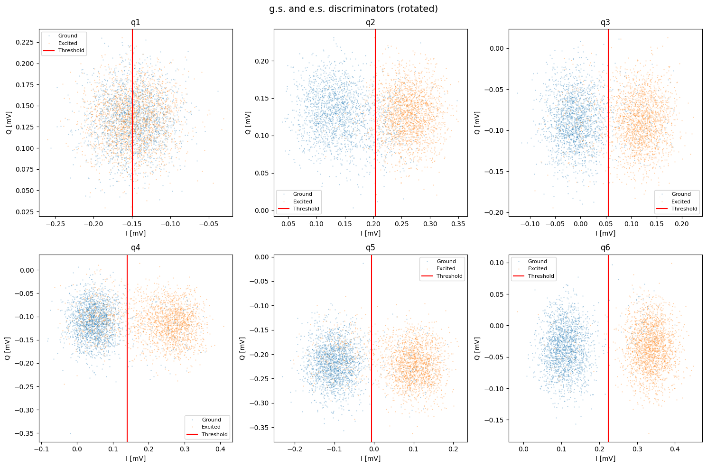
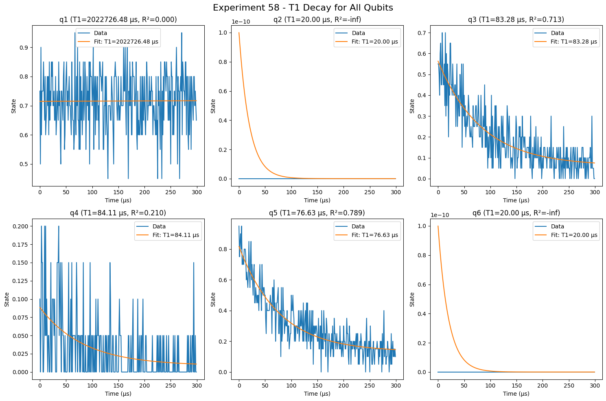

# Qubit Readout Analysis (PHY 763, HW3)

This is my writeup for Homework 3 of PHY 763 at UW–Madison. The assignment was about reading out superconducting qubits: how well you can tell the ground state from the excited state, how that discrimination sets the measurement fidelity, and how relaxation (T1) limits the whole thing. All of the datasets here were provided by the course staff, and the analysis and interpretation are my own.

## Readout discrimination

For the IQ blobs experiments (datasets 65 and 71) I rotated the single-shot measurements so that the ground and excited state distributions separate cleanly along one quadrature, put a threshold between them with `two_state_discriminator`, and built the confusion matrix to get a readout fidelity for each qubit.

Out of these, qubit 4 came out with the best average error per gate, around 0.07%, which means it has the cleanest and slowest-decaying readout. Qubit 2 had the best SPAM instead: its saturated-curve offset B ≈ 0.492 is the one that sits closest to the ideal, so its state preparation and measurement contribute the least error.

## T1 relaxation

For the next part I fit the excited-state population against delay to a decaying exponential, one fit per working qubit, using datasets 58 and 70.

The interesting bit is the comparison between the two: there was a large jump in performance between the experiments run on 2025/10/13 and 2025/10/14, and it traces back to the qubit tune-up that happened between those two days. All of the parameters behind that live in the `state.json` calibration file, so part of the work was diffing those files to see what actually changed and connecting it back to the measured T1.

## A note on the data and the files

The datasets and the QOLab/Qualibrate calibration state are course infrastructure and are not public, so the `data` folder is not included here. What is in this repo is the writeup and the result figures. I left out the full solved notebook and the graded report on purpose, but I am happy to share them if you want to see the whole analysis.

## License

MIT (see `LICENSE`). This covers my own code and writing. The experimental data belongs to the PHY 763 course and is not redistributed here.
